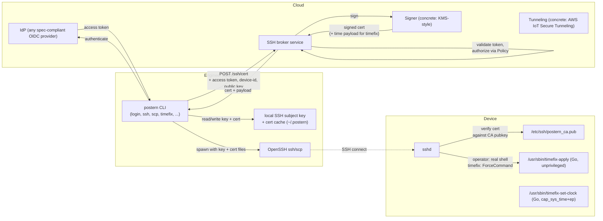
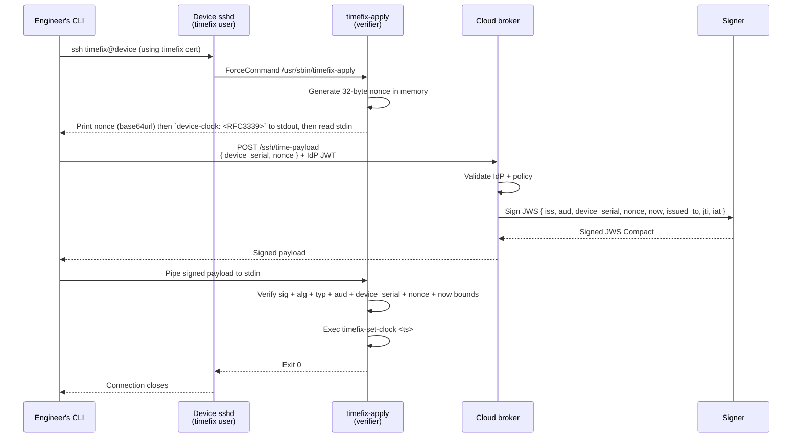
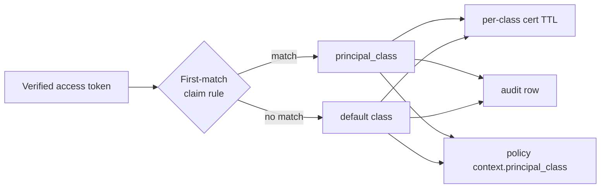
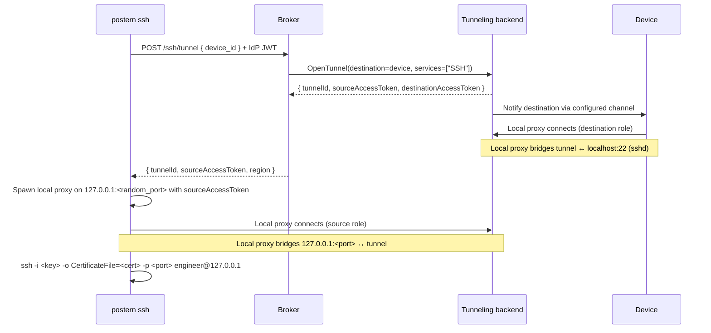

# Postern: SSH access framework for embedded device fleets

> **Status:** living design document for the shipped implementation. Design changes land here first, as PRs against this doc.

## Why Postern exists

If you're shipping connected hardware — a medical device, a robot, a piece of industrial IoT, a connected science instrument, a kiosk — your engineers will eventually need SSH access to those devices in the field for diagnostics. Every such company runs into the same set of constraints:

- Devices live in customer environments behind firewalls, often unreachable from anywhere except the customer LAN.
- Devices may be offline for extended periods.
- Real-time clocks fail (RTC battery dies, time drifts) — and SSH cert validity windows depend on the device's clock.
- Diagnostics-time SSH must be auditable: who, when, which device, with what authorization.
- Shared SSH keys are a liability and don't scale to a fleet or to a team.
- Off-the-shelf SSH access platforms (Teleport, HashiCorp Boundary) are designed for server fleets, not embedded devices, and bring infrastructure overhead disproportionate to the problem.

What companies build instead is a one-off internal tool: a Lambda, a shell script, some shared keys, some `aws iot` calls, glued together with bash. Postern is that tool, factored as a reusable framework.

The reusable pattern is:

1. **Engineer authenticates via corporate SSO** — not a shared key. Identity is the trust root.
2. **A cloud broker mints short-lived SSH certificates** scoped to specific devices, signed by a CA whose private key lives in an HSM-style backend.
3. **Devices have a stable on-device principal** (derived from hardware serial, available before any cloud bootstrap) that the cert principal must match.
4. **Broken clocks are recoverable** through a separate forced-command path that uses a cloud-signed time payload with a per-invocation nonce for replay protection — no persistent device-side state needed.
5. **Reachability handles the firewall problem** via a tunneling backend (e.g., AWS IoT Secure Tunneling) when the engineer can't reach the device's LAN directly.
6. **Privilege is split** on-device — the verifier that handles untrusted input is unprivileged; only a tiny dedicated binary has the capability to set the clock.
7. **Audit is end-to-end** — cloud-side issuance log + device-side session log, joinable by certificate identity.

Postern packages this pattern as a reusable framework with focused concrete implementations of each pluggable backend.

## What Postern is

A toolkit for **engineer SSH access to embedded Linux device fleets**. Components:

- A **cloud broker** that takes engineer SSO assertions and issues short-lived SSH certificates for specific devices.
- An **engineer CLI** (`postern` binary) that handles browser-based SSO, keychain-stored tokens, certificate caching, secure-tunnel orchestration, and `ssh` / `scp` invocation.
- Two **on-device binaries** for handling devices with broken real-time clocks: a privilege-split verifier + setter that lets an engineer fix the clock via a forced SSH command without compromising the rest of the system.
- **Pluggable abstractions** for IdP, signing key storage, secure tunneling, audit log sink, and device-identity registry — with focused concrete implementations shipped in v1. The Registry ships a DynamoDB-backed default plus an HTTP-backed concrete for deployments that already have a device inventory service. Other implementations are added when there's actual demand for them.

How the on-device binaries get packaged into a specific distribution (Yocto, Buildroot, OS image bake, container, etc.) is an integration concern, out of scope for the design doc. The binaries are static-linked Go (`CGO_ENABLED=0`) and self-contained; any reasonable embedded packaging system can carry them.

### Why a framework rather than a single binary

Postern is primarily a complete unwrapped product: the `postern` CLI, broker, and on-device binaries work end-to-end without modification. The framework structure additionally **leaves wrapping possible** at a well-defined composition boundary, for operators who want to add organization-specific subcommands, swap concrete abstraction impls, or compose the broker's HTTP handlers with extra middleware — without forcing them to fork. The abstractions hide the parts that vary by deployment (IdP, signing backend, tunneling provider) behind interfaces with one default impl, which serves both modes: unwrapped operators get sensible defaults, wrapping operators substitute via constructor injection. Wrapping is a supported path, not the primary design driver — internal seams below the `pkg/` boundary owe wrappers no stable surface.

## Goals and non-goals

**Goals**

- Replace ad-hoc shared-SSH-key practices with short-lived certificate auth gated by corporate SSO.
- Work for devices that may be offline, behind firewalls, or have unreliable clocks.
- Single static binaries on every side (cloud, engineer laptop, device) with minimal runtime dependencies.
- Auditable end-to-end: cloud-side issuance log + device-side session log, joinable by certificate identity.
- Work with **any spec-compliant OIDC IdP** out of the box (Cognito, Auth0, Okta, Keycloak, Azure AD, Google Workspace, internal OIDC). The v1 IdP impl is a generic OIDC verifier; AWS-native pieces (KMS, IoT Secure Tunneling, CloudWatch Logs) are the v1 concretes for the other abstractions. Abstractions stay explicit so other backends can be added.
- Serve as a reusable framework that downstream operators wrap into their own tooling without forking.

**Non-goals**

- Replacing existing heavy SSH access platforms (Teleport, HashiCorp Boundary). Postern is lighter-weight and embedded-fleet-specific.
- Defeating physical compromise of devices.
- Centralized device management or fleet operations beyond SSH access.
- Recording session contents (designed-in path for adding auditd / recorded-shell wrappers later, but log-only audit by default).

## Threat model

| Threat | Mitigation |
|---|---|
| Stolen engineer laptop | Engineer credentials short-lived (operator cert valid +12h forward, with a 1h backward clock-skew pad — 13h total window). The local Postern SSH subject key is persistent but has no standalone authority; access requires an unexpired broker-signed cert. Cached certs are reused only inside their validity window with a safety margin. All new issuance is SSO-gated. Refresh tokens kept in OS keychain with short TTL. |
| Replayed credentials against an offline device | Operator certs carry `ValidBefore` and are validated by the device. Replay window bounded by cert TTL. |
| Broken / drifted device clock breaks SSH | Long-lived `timefix` cert path, separate user, forced command, cloud-signed time payload with device-issued nonce for anti-replay. |
| Forged time payload | JWS-signed by the SSH CA private key (held by the configured Signer). Verifier hardcodes algorithm and pubkey; without the CA private key, no valid payload. |
| Replay of an old time payload against the same device | Each timefix invocation generates a fresh 32-byte nonce in the device's verifier process. The nonce is echoed in the broker's signed payload; an old payload carries a stale nonce that doesn't match the current invocation's challenge. |
| One credential opens the entire fleet | SSH certs scoped to a specific device principal (`device-{serial}-operator` / `device-{serial}-timefix`). Cert won't auth on any other device. Broker resolves whatever identifier the engineer provides to the canonical per-device principal at cert-mint time. |
| Service exposure beyond SSH | Diagnostic surface = sshd only. No HTTP/gRPC services on device. Timefix is implemented as an SSH ForceCommand, not a separate listener. |
| Compromise of the SSH CA key | Signer-held (KMS or equivalent); access via tightly scoped IAM. Compromise requires shipping a new CA pubkey to fielded devices via OS update. Slow-recovery scenario, acknowledged as the cost of an offline-tolerant model. |
| Privilege escalation via the timefix path | Privilege-split: verifier runs as unprivileged user, setter has `CAP_SYS_TIME` only via Linux file capabilities. No SUID, no sudo. Even a verifier-side bug bounds attacker control to "set the clock to a value of their choosing." |

Key threat *not* covered: **physical compromise of the device.** Anyone with physical possession of a device can extract its filesystem, write to it, swap hardware, etc. Out of scope.

## Architecture at a glance



## Trust hierarchy: one CA, three signing roles

Three signing roles, all served by **one CA private key** (the **Postern SSH CA**):

1. **Operator SSH cert signing** — short-lived certs that grant real-shell access. Principal `device-{serial}-operator`.
2. **Timefix SSH cert signing** — long-lived certs that authorize a user to run the `timefix-apply` forced command. Principal `device-{serial}-timefix`.
3. **Time payload signing** — signs the small time-update payload that `timefix-apply` consumes via stdin.

All three roles use the same private key (held by the configured Signer; KMS-style external HSM is the recommended deployment). The on-device public key (`/etc/ssh/postern_ca.pub`) covers all three:

- For roles (1) and (2), sshd uses `TrustedUserCAKeys /etc/ssh/postern_ca.pub`.
- For role (3), `timefix-apply` reads the same file to verify the time payload signature.

### Why one CA and not three

The instinctive design uses three CAs for blast-radius limitation: separate keys for engineer access, timefix, and time-payload signing. That separation only buys something when one key compromise can't be exploited to compromise the others. Neither candidate split achieves that here:

- **Root vs Timefix CA** — SSH cert *principals* and sshd's per-user `AuthorizedPrincipalsFile` already discriminate access. Two CAs only differentiate if their keys live in genuinely different blast-radius zones (different HSMs, different IAM), which isn't how cloud KMS-style backends are typically run.
- **Time Authority separation** — only matters if devices enforce forward-only time, which requires persistent "highest-time-seen" state on device. We deliberately don't (brittle: RTC corruption, manufacturing testing, debugging rollback all break it), and rewinding the clock is reachable trivially via `date -s` once an attacker has shell access.

One CA, three roles, one private key in the Signer.

## SSH cert types

### Operator cert (real shell)

| Field | Value |
|---|---|
| CA | Postern SSH CA |
| Type | User cert |
| Principal | `device-{serial}-operator` |
| ValidAfter | issuance time − 1 hour (clock skew tolerance) |
| ValidBefore | issuance time + 12 hours |
| Cert extensions | `permit-pty`, `permit-port-forwarding`, `permit-agent-forwarding`, `permit-X11-forwarding`, `permit-user-rc` — the full default set ssh-keygen stamps on a cert, so the operator cert behaves like a normal key. Authorization is enforced by the broker Policy and the short validity window, not by clamping the engineer's interactive surface after access is granted. Devices that want to constrain forwarding do so in sshd config. |
| Critical options | none |
| Key ID (audit) | `engineer_sub:<idp-sub>;engineer_email:<email>;jti:<broker-issued-uuid>` |

The cert principal must match the device's authorized-principals file content, which is populated at boot from the device serial. If the cert principal doesn't match, sshd rejects.

### Timefix cert (forced command)

| Field | Value |
|---|---|
| CA | Postern SSH CA (same key) |
| Type | User cert |
| Principal | `device-{serial}-timefix` |
| ValidAfter | 1970-01-01 (Unix epoch — the floor any dead-RTC device can boot at; going earlier wraps via the `uint64` cast and breaks recovery) |
| ValidBefore | 3000-01-01 |
| Cert extensions | none |
| Critical options | `force-command=/usr/sbin/timefix-apply` (redundant with sshd `Match User timefix` ForceCommand, but defense-in-depth in case of sshd config drift) |
| Key ID (audit) | same shape as operator |

The timefix cert is functionally inert without an accompanying signed time payload — the forced command refuses to do anything if it doesn't get one. So a stolen timefix cert in isolation grants nothing actionable.

### Time payload — JWS Compact, EdDSA, with device-issued nonce

The time payload is a **JWS Compact-serialized JWT**, signed by the Postern SSH CA private key (EdDSA / Ed25519), with a **device-generated nonce echoed back in the claims** for replay protection.

**Header:**

```json
{ "alg": "EdDSA", "typ": "postern-timefix+jwt" }
```

**Payload:**

```json
{
  "iss": "postern.broker",
  "aud": "device-{serial}-timefix",
  "device_serial": "<serial>",
  "nonce": "<base64url of device-generated 32 random bytes>",
  "now": "<ISO8601 timestamp>",
  "issued_to": "<idp-sub>",
  "jti": "<broker-issued uuid>",
  "iat": <unix-time>
}
```

**Wire form:** `base64url(header).base64url(payload).base64url(signature)` — three dot-separated segments, ~400 bytes total.

#### Why JWS Compact (and not CMS)

CMS (PKCS#7 SignedData) is what mature code-signing schemes use (Authenticode, Apple codesign, Java JAR), but it's designed for large payloads carrying cert chains alongside — the verifying key isn't necessarily pre-trusted on the receiver. Our payload is small, and the verifying key is pre-shipped on every device. JWS has a mature Go library (`go-jose/v4`), avoids ASN.1/DER tooling overhead, and pipes through SSH stdin without trouble (~400 bytes vs CMS's hundreds of bytes of envelope overhead).

Specific JWS properties we use:

- **Algorithm pinned at the verifier.** `alg: EdDSA` and the public key are hardcoded. No fallback paths, no `alg: none`. Closes the algorithm-confusion attack class.
- **Custom `typ` field** (`postern-timefix+jwt`) discriminates this token from any other JWT a verifier might encounter. The verifier rejects other `typ` values, closing confused-deputy attacks where a leaked token from a different system is reused.
- **Compact serialization** is exactly three base64url segments separated by dots — easy to pipe, easy to log (truncate the signature for log lines), easy to test.

#### Device-side validation

The forced command's verifier rejects unless **all** of the following hold:

1. The header's `alg` is exactly `EdDSA`.
2. The header's `typ` is exactly `postern-timefix+jwt`.
3. The signature verifies against the on-device CA pubkey at `/etc/ssh/postern_ca.pub`.
4. `aud` equals this device's timefix principal (`device-{serial}-timefix`).
5. `device_serial` equals this device's serial.
6. `nonce` equals the **in-memory nonce this process generated at startup**. Anything else is a replay attempt — reject.
7. `now` parses as ISO8601 and falls within a sane bound (e.g., `(2024, 2099)`).

`iat` is **not** checked against the device clock — the device clock is exactly what we don't trust here. The cloud broker is responsible for not signing payloads with stale `iat`s; the device's nonce check is what stops replay.

#### Challenge-response flow



The nonce is purely in-memory for one process invocation. No persistence, no `highest-time-seen` state, no need to track previously-used jti's. Process exit clears it.

## sshd config (sketch)

```
TrustedUserCAKeys /etc/ssh/postern_ca.pub
AuthorizedPrincipalsFile /etc/ssh/authorized_principals/%u
AuthorizedKeysFile none

PermitRootLogin no
PasswordAuthentication no
KbdInteractiveAuthentication no
PubkeyAuthentication yes

LogLevel VERBOSE

# Real-shell engineer
Match User engineer
    AllowTcpForwarding local
    AllowAgentForwarding no
    X11Forwarding no
    PermitTunnel no

# Time fix
Match User timefix
    ForceCommand /usr/sbin/timefix-apply
    PermitTTY no
    AllowTcpForwarding no
    AllowAgentForwarding no
    X11Forwarding no
    PermitTunnel no
```

`/etc/ssh/authorized_principals/engineer` contains exactly one line: `device-{serial}-operator`. `authorized_principals/timefix` contains `device-{serial}-timefix`. These are populated at boot by the principals-init service.

## Device identity and on-device principals

The on-device principal must be derivable **before any cloud-provisioning step** — the post-disaster recovery case is exactly when SSH access matters most. That rules out cloud-derived identities (e.g., AWS IoT thing names) for the on-device side.

The canonical on-device identity is whatever the operator's `principals-init` script writes into `/etc/ssh/authorized_principals/<user>` at boot — typically the device hardware serial (e.g., from `/proc/device-tree/serial-number`) but operators may use any stable identifier (inventory ID, MAC address, hostname) as long as the cloud-side registry returns the same value. The kernel-exposed hardware serial is the recommended source for the recovery property: it's available on every boot regardless of whether any provisioning has completed. The cloud-side broker maintains a mapping from this identifier to whatever friendlier names the operator wants engineers to type.

The `/etc/ssh/authorized_principals/<user>` file is the single source of truth on the device: sshd reads it to admit incoming cert principals, and the timefix verifier reads it (specifically `/etc/ssh/authorized_principals/timefix`) to derive its expected `aud` and `device_serial` claims. Both stay in lockstep without an extra hardware-path dependency on the verifier side.

### Principals-init systemd unit

```
[Unit]
Description=Postern SSH authorized_principals init
DefaultDependencies=no
After=systemd-tmpfiles-setup.service
Before=sshd.service
ConditionPathExists=!/etc/ssh/authorized_principals/.initialized

[Service]
Type=oneshot
ExecStart=/usr/sbin/postern-principals-init
RemainAfterExit=yes

[Install]
WantedBy=multi-user.target
```

`/usr/sbin/postern-principals-init` (small bash script):

1. Read the device identifier from the operator's chosen source — typically `/proc/device-tree/serial-number`, but any stable identifier the cloud-side registry also returns works (operator's call).
2. Write `device-{identifier}-operator` to `/etc/ssh/authorized_principals/engineer`.
3. Write `device-{identifier}-timefix` to `/etc/ssh/authorized_principals/timefix`.
4. Set ownership `root:root`, mode `0644`.
5. Touch `/etc/ssh/authorized_principals/.initialized` so subsequent boots no-op.

Runs early in boot, before sshd. SSH access is available as soon as sshd starts — no dependency on Greengrass, the IdP, or any cloud provisioning step.

If the configured serial source is unreadable or empty, the script aborts and the principals files are not created. sshd then has no valid principals to match and SSH access fails closed.

### Cloud-side identity mapping

The broker's Registry abstraction maintains a mapping from the canonical device serial to whatever identifiers the deployment wants engineers to type. A typical schema:

```
Serial            FriendlyId       (other operator-defined columns)
1424223030014     prod-a012        ...
1424223030015     prod-a013        ...
```

The broker's `/ssh/cert` endpoint accepts any registered identifier, looks up the record, mints the cert with the canonical `device-{serial}-operator` principal. The CLI passes through whatever the engineer typed — Postern doesn't care which form it is.

The unwrapped broker ships two Registry concretes:

- The DynamoDB-backed Registry, used when `registry.dynamodb_table` is configured.
- The HTTP-backed Registry, used when `registry.http_url` is configured. This lets operators adapt Postern to an existing internal device-inventory service without forking the broker.

The HTTP Registry contract is intentionally small:

```
GET <registry.http_url>?device_id=<urlencoded device id>
Accept: application/json
```

Successful response:

```json
{
  "serial": "1424223030014",
  "friendly_id": "prod-a012",
  "attributes": {
    "fleet": "production",
    "in_production": true,
    "firmware_revision": 42
  }
}
```

`serial` is required and becomes the canonical device principal input. `friendly_id` and `attributes` are optional and flow into Policy context. Attribute values may be strings, booleans, or integer JSON numbers; they map into Cedar policy evaluation as native `String`, `Boolean`, and `Long` respectively. Other JSON types (floats, arrays, nested objects, null) are dropped so Cedar policies see only types it can compare with. `404 Not Found` means the device identifier is unknown. Any other non-200 status is treated as a Registry dependency failure.

The v1 HTTP Registry supports three authentication modes, selected via `registry.http_auth_mode`:

- **`none`** (default) — no Authorization header. Suitable for endpoints reachable only on a trusted network path.
- **`bearer`** — sends `Authorization: Bearer <token>` on every request. The token is configured via `registry.http_bearer_token` (typically populated from `POSTERN_REGISTRY_HTTP_BEARER_TOKEN` rather than YAML literals).
- **`aws_sigv4`** — signs every request with AWS SigV4 against the `execute-api` service in `registry.http_aws_region` (or the AWS SDK's default-region chain when empty). Credentials come from the broker's AWS-SDK default chain — environment, shared config, IMDS, ECS task role, or Lambda execution role — which means broker-as-Lambda or broker-as-ECS-task picks up its IAM identity automatically.

Operators with a different auth scheme (mTLS, signed JWT, HMAC, custom header) put a proxy in front of the registry endpoint that adds the header, or wrap the broker with their own Registry impl.

The per-request HTTP timeout is configurable via `registry.http_timeout` (Go duration string) — or `POSTERN_REGISTRY_HTTP_TIMEOUT`, or the `registry_http_timeout` Terraform variable. Default is 15 seconds, sized for the typical Lambda-fronted-by-API-Gateway cold-start budget. Operators on faster registries can tighten; operators on slower paths can loosen up to the broker's outer Lambda timeout.

### Reflash behavior

Reflashing the OS deletes `/etc/ssh/authorized_principals/.initialized`. On next boot, the principals-init service re-runs and re-derives the principals files from the (unchanged) hardware serial. Same content as before, no manual intervention required.

### Hardware swap

If the SoC/SoM is replaced, the new hardware has a new serial. Principals-init regenerates with the new serial; sshd accepts certs against the new principal. The cloud-side mapping needs an update step on board swap — out of scope for the Postern framework but a runbook concern for downstream operators.

## The on-device timefix path (privilege-split)

The forced command runs as the unprivileged `timefix` user — *not* root. Setting the system clock requires `CAP_SYS_TIME`, but we don't grant that to the verifier. The work is split across two binaries:

### `/usr/sbin/timefix-apply` (Go) — verifier

Runs as user `timefix` with **no special privileges, no SUID, no capabilities**. This is the binary sshd's ForceCommand points at.

1. **Generate a 32-byte nonce** from `/dev/urandom`. Hold it in memory.
2. **Print** the nonce (base64url) to stdout, then a newline. Then print `device-clock: <RFC3339 UTC>` and a newline — the engineer's CLI surfaces this in verbose output so the engineer can see what the device's current clock thinks it is, useful for diagnosing whether the recovery flow is even needed. Flush.
3. **Read stdin until EOF** — the engineer's CLI pipes the signed payload back in.
4. **Parse the JWS Compact** form: split on dots into header / payload / signature segments.
5. **Verify** the JWS:
   - `header.alg == EdDSA` (no fallback)
   - `header.typ == postern-timefix+jwt`
   - Signature verifies against `/etc/ssh/postern_ca.pub`
6. **Validate claims:**
   - `aud == device-{serial}-timefix`
   - `device_serial == ` running device's serial
   - `nonce == ` the nonce generated in step 1
   - `now` parses as ISO8601 within `(2024, 2099)`
7. **Exec `/usr/sbin/timefix-set-clock <unix-timestamp>`** — passing only the validated `now` as a unix timestamp argument.
8. Emit a structured log line including `payload.issued_to`, `payload.jti`, and the (truncated) nonce for journald.
9. Exit 0 on success, non-zero with clear stderr on any validation failure.

### `/usr/sbin/timefix-set-clock` (Go) — privileged setter

Tiny binary with a Linux file capability set in the recipe:

```
setcap cap_sys_time+ep /usr/sbin/timefix-set-clock
```

Runs as user `timefix` (whatever invokes it), but the `+ep` makes `CAP_SYS_TIME` effective+permitted on this binary. No SUID, no root user involved.

Behaviour: takes one CLI argument (the unix timestamp), validates it parses as a sane integer in a sane range, calls `clock_settime(CLOCK_REALTIME, ...)`, then writes the RTC via the kernel's `RTC_SET_TIME` ioctl on `/dev/rtc0` (so the change survives reboot). Logs success or fail. Exits.

Deliberately minimal — single-digit-line count of meaningful code, no untrusted-shape input parsing, no dynamic dispatch. It's the only piece of code in the system with `CAP_SYS_TIME`, and its only job is one syscall + one ioctl from a single integer arg.

### Why split into two binaries

A single `CAP_SYS_TIME` binary doing both verify and set would put parsing-and-crypto code (where bugs land) inside a kernel-privileged process. The split keeps that surface unprivileged: the verifier has zero privileges (a bug there gives at worst a `timefix`-user shell with nothing reachable), the setter has exactly one capability and trivially small attack surface. Even a verifier bug that lets an attacker control the timestamp arg bounds the damage to setting the clock — no root escalation, no persistence, no other capabilities.

We use **file capabilities** (`setcap cap_sys_time+ep`) rather than SUID. SUID carries known footguns (env handling, argv handling, descriptor inheritance); file capabilities are the modern Linux primitive (same mechanism powers unprivileged `ping`).

## Cloud broker

A small custom service hosting the abstractions. Stateless except for audit emission, Registry lookup, and rate-limit counters.

Runtime-agnostic: the broker's HTTP handlers are exported as plain `http.Handler` types with no Lambda or runtime-specific surface. Two unwrapped binaries ship side by side, both wiring the same handlers from the same shared dep-construction helper:

- A long-running HTTP server (`cmd/broker`) for Fargate, ECS, EC2, or local development.
- An API-Gateway-fronted Lambda (`cmd/broker-lambda`) that wraps the same handler stack with `aws-lambda-go-api-proxy`. This is the v1 reference deployment — the `terraform/postern-broker/` Terraform module packages this binary and stands up the supporting AWS resources.

For Lambda, operators may also choose to deploy the long-running binary behind Lambda Web Adapter (zero code changes); the v1 reference picks the explicit-Lambda path because it avoids the runtime extension and keeps the cold-start init paths visible in Go code.

TLS is terminated at the front door — API Gateway or ALB — and the broker speaks plain HTTP behind it. A `/healthz` endpoint is exposed for ALB target-group health checks.

When the broker sits behind an LB, operators set `trusted_proxies` to the LB's egress CIDRs so the broker derives the engineer's source IP from the rightmost-non-trusted entry in `X-Forwarded-For` (rather than the LB's connecting address). Operators **must** also restrict the broker's listen socket to ingress from those same CIDRs at the network layer — security group, VPC ingress rule, or equivalent. Without that lockdown, an attacker reaching the broker directly can spoof `X-Forwarded-For` and the rightmost-trusted-range strategy will return the attacker-controlled IP into the audit log, AVP context, and any IP-based Cedar policy decisions.

Operational logs use `log/slog` (stdlib). The Audit sink is separate and structured per the audit contract below.

Dependencies are wired in the broker's `main` via plain Go constructor injection — a `Deps` struct passed to a `New(deps)` constructor.

### Endpoints

```
GET /healthz
(no auth)
Returns: 200 OK / 503 if a critical dep is unhealthy

POST /ssh/cert
Authorization: Bearer <IdP access token>
Body: { device_id, principal_type: "operator" | "timefix", public_key }
Returns: { ssh_cert, ca_pubkey_fingerprint }

POST /ssh/time-payload
Authorization: Bearer <IdP access token>
Body: { device_id, nonce }       # nonce: base64url of 32 bytes from device
Returns: { jws }                  # JWS Compact "<header>.<payload>.<sig>"

POST /ssh/tunnel
Authorization: Bearer <IdP access token>
Body: { device_id, max_lifetime_minutes? }
Returns: { tunnel_id, source_access_token, region }
```

The Bearer token is the IdP-issued **access token** (not the ID token). The broker validates it against the configured `idp.audience` and/or `idp.required_scope` to ensure the token was issued for this broker. ID tokens are CLI-side only — used for displaying the engineer's identity locally; never sent to the broker.

`device_id` (in the JSON body) is whatever identifier the engineer typed on the command line as `<device-id>` — the broker's Registry resolves it to the canonical hardware serial used in the cert principal.

The `/ssh/tunnel` route is always mounted; if the deployment has not configured a Tunneling backend, it returns 501 Not Implemented. CLI handles this as a clean error rather than pre-discovering capability.

The broker has no pre-auth bootstrap endpoint. The CLI knows the IdP from its own config file (operator publishes IdP issuer, client ID, and audience/scopes alongside the broker URL); the broker is contacted only for SSH-related operations, all authenticated.

### Token validation

The broker validates the incoming access token before any authorization decision. **Validation is the broker's responsibility, not the IdP's** — the IdP issues tokens with claims (`aud`, `scope`, `iss`, `exp`); it cannot prevent another resource server from accepting tokens not intended for it. If the broker doesn't enforce audience/scope, an IdP that authorizes Engineer X for Cognito App A and *not* App B will still let App A's token work against App B's broker. That is the cross-app authorization risk the validation step closes.

Tokens are validated **twice** by design when AVP is the Policy impl: once by the broker (signature + iss + aud/scope + exp + Cognito's `token_use=access` if applicable) before any policy call, then again by AVP via its own OIDC identity source. This is intentional defense in depth — AVP must trust its own input, and the broker enforces a hard gate before the policy call costs anything. The double validation adds microseconds and removes a failure mode where a bug in either layer would let bad tokens through.

The v1 IdP impl is a generic OIDC verifier built on `github.com/coreos/go-oidc/v3` — handles OIDC discovery (`/.well-known/openid-configuration`), JWKs fetching with `kid`-aware caching, signature verification, and standard claim parsing. Standards-compliant and works with any spec-compliant IdP — Cognito, Auth0, Okta, Keycloak, Azure AD, Google Workspace, internal OIDC providers. Per-IdP quirks (notably Cognito's `token_use` claim) are handled inside the IdP impl, not exposed in the abstraction. With RFC 8707 resource binding (the CLI sends the configured broker resource as `resource` on /authorize), Cognito access tokens carry a normal `aud` claim too — the broker's validator treats Cognito the same as any other RFC 9068-style IdP.

Validation criteria, all of which must pass:

1. **Signature** verifies against the IdP's JWKs (fetched via OIDC discovery from the configured `idp.issuer`, refreshed on `kid` miss).
2. **`iss`** claim matches the configured `idp.issuer`.
3. **`exp`** is in the future; **`iat`** within reasonable skew.
4. **`token_use == "access"`** if the token is a Cognito-issued access token (defends against accidental ID-token submission). Other IdPs that don't emit `token_use` skip this check.
5. **Audience and/or scope** matches the broker's configuration:
   - If `idp.audience` is configured: the token's `aud` claim must contain or equal it (RFC 9068 IdPs).
   - If `idp.required_scope` is configured: the token's `scope` claim must contain it (Cognito and IdPs that gate via scopes).
   - If both are configured, **either** match suffices (OR): a token carrying a matching `aud` *or* a matching scope passes. This serves a single IdP whose caller classes differ — e.g. Cognito human tokens carry `aud` (RFC 8707 resource binding) while client-credentials tokens carry only a scope. Cross-app isolation still holds: a token with neither a matching `aud` nor a matching scope is rejected.
   - If neither is configured, the broker fails closed at startup — at least one defense must be active.

#### Principal classes

Beyond verifying the token, the broker classifies each caller into a **principal class** so authorization, certificate lifetime, and audit can treat automated callers differently from humans. The class is inferred purely from claims already present in the verified access token — there is no identity database and no live IdP lookup. Operators configure an ordered list of first-match rules; each rule maps a claim predicate (a claim being present, absent, equal to a value, or a scope being present) to a class name, with a default class when no rule matches. The default configuration classifies every caller as a human user, so deployments that don't need the distinction are unaffected.

The mechanism accommodates how different providers mark machine-to-machine tokens. Some providers emit a positive marker (a grant-type claim or a custom claim/scope granted only to service-account clients); others, notably Cognito, emit no positive machine marker, so the distinguishing signal is the *absence* of a user-only claim (such as the user's username) on a client-credentials token. Supporting both presence and absence predicates lets one generic OIDC verifier classify either family without a provider-specific implementation.

The class is derived once, by the verifier, and becomes the single source of truth. The broker uses it to bound the certificate validity window by a per-class ceiling, to stamp the class (and, for automated callers, the issuing client identifier) onto every audit row, and to supply the class and client identifier to the Policy layer as request context. The Policy layer does not re-derive the class; it consumes the broker's classification as a trusted input, the same way it consumes broker-resolved device attributes. This keeps the lifetime, audit, and policy views of "who is calling" from drifting.

Certificate lifetime follows a propose-and-gate model. The caller may request a lifetime; the broker clamps it to the per-class ceiling and supplies the resolved value to the Policy layer as request context, so policy can tighten it further per fleet, class, or client. The Policy layer can only deny, never widen: the applied window never exceeds the broker's per-class ceiling, and the usual clock-skew padding still applies. This mirrors how the tunnel pipeline already gates a requested tunnel lifetime through policy context. The Policy layer returns only an allow/deny decision, so it never names a lifetime the broker reads back — it gates a value the broker proposes.

The class is delivered to the Policy layer as request **context**, not as a distinct principal entity type. Under token-based authorization the principal entity type is fixed by the policy service's identity source, not chosen by the broker per request, and both supported identity-source flavors map a token to the same principal type. Expressing the class as a context attribute is uniform across identity sources, requires no identity-source change, and keeps the class a broker-owned input consistent with its role as the single source of truth. Policies branch on the class and client identifier through context conditions.



Authorization (who is allowed to do what) is a separate concern handled by the `Policy` interface below.

### Authorization policy

Beyond token validation, the broker delegates per-request authorization to a pluggable `Policy` interface:

```
Policy.Allow(ctx, req PolicyRequest) error

PolicyRequest {
    AccessToken string         // raw bearer token; AVP impl re-validates against its own OIDC identity source
    Engineer    EngineerClaims // already-validated claims (sub, email, groups, custom)
    Device      DeviceRecord   // resolved Registry record: serial, fleet, owner team, etc.
    Mode        Mode           // "operator" | "timefix" | "tunnel"
    SourceIP    string         // request source IP for context-aware policies
    UserAgent   string
    RequestID   string
    // Plus broker-derived context: principal_class, client_id (for automated
    // callers), and the clamped requested certificate lifetime — surfaced to
    // the impl as policy context, not as typed principal fields.
}
```

The interface gives the impl everything an authorization decision could care about. AVP-style impls pass `AccessToken` to `IsAuthorizedWithToken` and let AVP extract the principal entity; cedar-go-local or custom impls can synthesize entities from `Engineer` directly. The broker's pre-Policy validation already ensures `AccessToken` is signature-valid and not expired — AVP then re-validates against its own OIDC identity source (defense in depth: AVP must trust its own input).

The v1 default impl is **Amazon Verified Permissions (AVP)** — AWS's managed Cedar evaluation service. Policies live in an AVP policy store as data; the broker calls `IsAuthorizedWithToken` per request. AVP returns ALLOW or DENY. This is consistent with Postern's other AWS-native v1 defaults (KMS, IoT Secure Tunneling, CloudWatch); operators going non-AWS swap all five.

Why AVP over an embedded engine:

- **Externalized policy management.** Operators (often security/governance teams, not the team running the broker) manage policies as AWS resources via Console / CLI / IaC. Policy changes don't require broker redeployment.
- **CloudTrail audit trail** of every authorization decision.
- **Cedar** is a real policy language with default-deny semantics, schema, multi-policy composition, and an open-source spec — operators not committed to AVP can later swap to local cedar-go evaluation if they want to leave AWS, since the policy language is portable.
- **`IsAuthorizedWithToken`** consumes the engineer's access token directly; AVP validates and extracts the principal entity from claims, removing manual claim-extraction code from the broker.

The broker per-request call passes:

- **Principal** — derived from the access token by AVP via its OIDC identity source. Same configuration pattern for Cognito, Auth0, Okta, or any other compliant IdP: issuer URI, accepted client_ids, claim-to-attribute mappings. The groups claim is mapped to `principal.groups` in Cedar (or to parent entities, operator's choice in the identity-source config). The claim's source name is per-IdP — `cognito:groups` for Cognito, `groups` for Auth0/Keycloak, etc. — but the Cedar attribute it maps to is uniform (`principal.groups`), so policies don't need IdP-specific branching.
- **Action** — `Postern::Action::"MintOperatorCert"`, `"MintTimefixCert"`, or `"OpenTunnel"`, based on the request endpoint.
- **Resource** — `Postern::Device` entity with the canonical hardware serial as ID.
- **Entities** — additional entity attributes for the device (fleet, friendly id, owner team, environment, anything else the Registry record carries) so policies can reference them.
- **Context** — request-level data so policies can express IP allowlists, time-of-day windows, per-class rules, etc. Includes `source_ip`, request time, and user agent; the broker-derived `principal_class` and (for automated callers) `client_id`; the clamped `requested_cert_ttl_minutes` for the cert-mint actions; and `requested_max_lifetime_minutes` for the tunnel action. These let a policy branch on caller class and client, and tighten certificate or tunnel lifetime below the broker's per-class ceiling.

A starter Cedar policy:

```cedar
permit (
  principal,
  action == Action::"MintOperatorCert",
  resource is Postern::Device
) when {
  "postern-engineers" in principal.groups
};

permit (
  principal,
  action == Action::"MintTimefixCert",
  resource is Postern::Device
) when {
  "sre" in principal.groups
};

forbid (
  principal,
  action,
  resource is Postern::Device
) when {
  resource.fleet == "high-security" &&
  !context.source_ip.like("10.0.*")
};
```

Multi-environment operators run one AVP policy store per environment (dev/staging/prod) with the broker config in each environment pointing at its own store. The `policy.avp_policy_store_id` field is the only knob; per-env broker configs naturally separate.

For Cognito deployments, AVP can only see what's in the access token. Cognito access tokens include `cognito:groups` when the user belongs to Cognito groups, so the reference setup relies on that native claim for group-aware broker Policy. Operators that need custom attributes or non-group claims in access tokens can add their own token customization outside the core sample.

For non-Cognito IdPs (Auth0, Okta, Keycloak, Azure AD) that put group/role claims in access tokens natively, no IdP-side Lambda is needed; AVP sees the claims directly and Cedar policies reference them.

Wrappers supplying their own `Policy` impl bypass AVP entirely (cedar-go local, OPA sidecar, custom Go, etc.). The interface stays small.

### Rate limiting

A separate `RateLimit` interface, distinct from `Policy`, enforces per-engineer request rate caps as defense against runaway scripts. The v1 default impl is DynamoDB-backed (per-engineer counters with TTL items), in its own table separate from the Registry. Wrappers can swap it independently of the Registry.

### Cert serial assignment

Every issued SSH cert needs a unique serial. The broker uses UUIDv7 truncated to its first 8 bytes (uint64), giving time-ordered, collision-resistant serials that fit OpenSSH's `uint64` cert serial field. The full UUID is also written to the audit log as `jti` for end-to-end joinability.

### Audit emission

Every issuance writes a structured audit log via the configured Audit sink:

```json
{
  "timestamp": "2026-04-29T12:00:00Z",
  "event": "ssh_cert_issued",
  "engineer_sub": "...",
  "engineer_email": "...",
  "device_serial": "...",
  "device_id_used": "<whatever the engineer typed>",
  "principal_type": "operator",
  "cert_serial": "<openssh-cert-serial>",
  "jti": "<uuid>",
  "valid_after": 1747000000,
  "valid_before": 1747043200,
  "issued_at": 1747000000,
  "source_ip": "203.0.113.1",
  "user_agent": "postern/1.0.0 (darwin/arm64)"
}
```

## CLI tooling

Binary name: `postern`. Single Go binary with subcommands: `login`, `mint`, `ssh`, `scp`, `add-host`, `remove-host`, `cache` (`ls` / `prune`), `timefix`, `upgrade`, `logout`, `configure`, `version`.

### Engineer auth: `postern login`

The CLI authenticates the engineer to the configured IdP using **OAuth 2.0 Authorization Code + PKCE with a localhost loopback callback** — the standard pattern used by `gh auth login`, `kubectl oidc-login`, etc.

Why this and not OAuth 2.0 Device Authorization Grant: not all OIDC IdPs support the device grant (Cognito User Pools notably do not), and a headless path that fails against the reference IdP is worse than none. Auth Code + PKCE is universally supported. Headless cases (engineer on a remote host, container, or jumphost without a local browser) use `--no-browser` plus SSH local port forwarding — see *Headless logins* below.

Flow:

1. CLI generates a PKCE `code_verifier` + `code_challenge`, plus a 32-byte random `state` value (CSRF defense, per OAuth 2.0 best practice).
2. CLI binds an ephemeral HTTP server on `127.0.0.1` to a port from the hardcoded port set (see *Callback URL strategy* below).
3. CLI opens the engineer's default browser to the IdP's authorize endpoint with `client_id`, the redirect URI pointing at the loopback, `state`, the PKCE challenge, `scope=openid email profile <profile-scopes>`, and (if configured) `audience=<profile-audience>`. The CLI always requests `openid email profile` and appends whatever extra scopes the resolved profile specifies.
4. Engineer authenticates.
5. IdP redirects back to `http://127.0.0.1:<port>/cb?code=<auth_code>&state=<echoed-state>`. CLI rejects the callback if `state` does not match what it generated.
6. CLI's local server catches the code, returns a "you can close this tab" page, then shuts down.
7. CLI POSTs to the IdP's token endpoint with the code and the verifier. Receives `{ access_token, id_token, refresh_token, expires_in }`.
8. CLI stores the access token, refresh token, and small metadata in the OS keychain (macOS Keychain / Windows Credential Manager / Linux Secret Service via `github.com/zalando/go-keyring`). Service name is `postern` or the wrapper's binary name; key names include the resolved profile name (for example `default:access-token`, `default:refresh-token`, `default:metadata`). Per-profile token slots let engineers stay logged in to multiple operators simultaneously. The ID token is not stored durably.
9. CLI prints `Logged in as <email>`.

The three tokens have distinct roles:
- **`access_token`** — the only token sent to the broker (`Authorization: Bearer`). Carries the `aud` and/or `scope` claims that the broker validates against its config.
- **`id_token`** — used **only for local display** in the CLI ("Logged in as foo@bar.com"). Never sent to the broker. ID-token misuse against APIs is a common mistake; we don't make it.
- **`refresh_token`** — used to renew the other two; sent only to the IdP's token endpoint.

Subsequent commands use the cached access token until it is close to its JWT `exp`, then refresh silently via the cached refresh token. If the refresh token has expired, the CLI prompts to re-run `postern login`.

Recommended IdP-side TTLs: **access token = 1 hour, refresh token = 24 hours, with refresh-token rotation enabled.** Engineers run `postern login` once per workday (browser SSO, MFA if configured), refresh their access token silently in the background as needed, and re-auth the next morning. Cognito's defaults (especially the 30-day refresh) are too long for this use case; the Cognito sample under `examples/` sets these explicitly. Refresh-token rotation defends against a leaked refresh token by invalidating it on the next legitimate refresh.

The token entries default to the OS keychain; on hosts without a reachable keychain the engineer selects an on-disk file backend instead — see *Token storage* below.

Automated callers (CI jobs, service accounts) skip the browser flow entirely. Their profile sets `grant: client_credentials` and the CLI obtains an access token directly from the IdP's token endpoint, supplying the client secret from the environment — never the config file. This path is browserless and keeps no cached refresh token: the credentials re-mint an access token on demand whenever the cached one nears expiry. The resulting token carries the same `aud`/`scope` claims the broker validates, and the broker classifies the caller as an automated principal class from its claims (see *Principal classes*).

#### Callback URL strategy

Many OIDC IdPs (notably Cognito) don't support arbitrary loopback port wildcards — callback URLs are matched literally. Postern uses a **hardcoded fixed set of loopback ports** (`50001-50010`); the operator must register all ten with their IdP's app client. The CLI tries to bind to them in order, picks the first free port, uses the corresponding registered URL.

The port set is hardcoded by build, not config — engineers can't change it (it has to match the IdP-side registration), and operators with conflicting port requirements build a custom binary with their own set.

10 entries gives ample headroom — port collision on an engineer's laptop is exceedingly rare. If somehow all are in use, the CLI errors with a clear message.

#### Headless logins: `--no-browser`

An engineer running `postern login` on a remote host, container, or jumphost with no usable local browser passes `--no-browser`. The CLI then skips the browser launch and instead prints the authorization URL plus the loopback port it is waiting on, leaving the redirect for the engineer to complete from a browser elsewhere. The OAuth flow is otherwise unchanged — same Authorization Code + PKCE, same loopback callback. This is not the device grant; it is the standard loopback flow with the browser step done by hand.

Completing the login still requires the IdP's redirect to reach the CLI's loopback listener, so the engineer forwards the port back with **SSH local port forwarding**:

```
ssh -L 50001:localhost:50001 remote-host
# Then on the remote host:
postern login --no-browser
```

The CLI prints the exact `ssh -L` line for the port it bound, so the forwarded port always matches the redirect URI baked into the printed URL. The `-L` flag tunnels the engineer's laptop port 50001 to the remote host's port 50001; when the engineer opens the printed URL on their laptop and the IdP redirects to `http://127.0.0.1:50001/cb`, the laptop's browser hits the tunneled port and the remote CLI's listener catches the code.

Because the CLI binds the first free port from the set, a busy port on the remote host shifts the listener to the next one — and now the engineer's pre-arranged `ssh -L 50001:...` points at the wrong listener. `--callback-port` pins a single port up front (constrained to the registered set) so the forward can be arranged in the same breath. An unregistered value is rejected before any IdP round-trip.

#### Threat: local-app silent authorization

The loopback flow inherits a limitation common to every public-client CLI that uses a system browser (`gh`, `aws`, `gcloud`, `kubectl oidc-login`): a **malicious process running as the engineer on the engineer's machine** can mint its own broker access token without the engineer noticing. The `client_id` is public (it lives in the engineer's config), so the malicious process initiates its *own* Authorization Code + PKCE flow with its own `code_verifier`, opens the engineer's browser to the authorize endpoint, and — if the browser holds a live IdP session — the IdP redirects back with a code and no user interaction. The attacker's own loopback listener catches the code and exchanges it.

PKCE does **not** defend against this. PKCE binds a code to the verifier held by whoever *started* the flow; it stops a third party who *intercepts someone else's* code from exchanging it. It does nothing against an attacker who legitimately starts their own flow. (This — native-app redirect interception and public-client impersonation — is much of why the Device Authorization Grant and claimed-`https`-redirect schemes exist. Neither is usable here: the reference IdP doesn't support the device grant, and a generic desktop CLI has no OS-guaranteed claimed-redirect equivalent.)

What bounds the exposure in Postern:

- The precondition is already-present local code execution as the engineer — an attacker at that level has many other paths (ptrace the CLI, shim `ssh`, key-log the SSO password). The marginal gain here is an *independent* token obtained without touching the CLI's keychain slot.
- Short token TTLs (recommended access = 1h, refresh = 24h with rotation) bound the window.
- Every certificate mint passes the broker `Policy` and lands in the `Audit` log under the engineer's identity, so abuse is authorized against the same rules and leaves a trail.

The mitigation that actually breaks the *silent* part is forcing fresh authentication on each login (an IdP `prompt=login` / `max_age=0`-style policy), so a background flow can't ride an existing session unseen. Whether an IdP honors that varies (it is not uniformly supported), so it's an operator-side IdP configuration choice rather than something the CLI imposes.

### Local SSH key and certificate cache

The CLI does not use `ssh-agent` for Postern-issued certs in v1. It invokes OpenSSH directly with explicit key and cert file options. This keeps Postern independent of platform-specific agent behavior, avoids mutating the engineer's existing agent state, and makes each `ssh` / `scp` invocation reproducible from the command line.

The CLI stores a Postern-managed SSH subject key and per-device certs under the CLI home dotdir (`~/.postern` for the unwrapped binary; wrappers use `~/.<binary-name>`). The parent directory is mode `0700`; private keys are mode `0600`.

- The subject key is an Ed25519 keypair scoped to the resolved profile. It is created exactly once per profile, reused across every device that profile talks to, and never rewritten by subsequent mints. Concurrent first-mint callers race for the create via an `O_EXCL`-equivalent link-into-place; only one writer succeeds and the losers re-read the on-disk key.
- Per-device certs are written atomically (write-temp-then-rename) into the same profile directory. A reader either sees the prior cert for that device or the new one; never a half-written file. The cert's subject public key is validated against the profile's stored public key on every read; cross-profile contamination is rejected with a typed error.
- Cache entries are scoped by resolved profile and the `device_id` string the engineer used. The CLI stores the OpenSSH cert and reads validity bounds, serial, key id, and principals from the cert itself.
- `postern mint <device>` always re-mints — it is the explicit "give me a fresh cert" verb. `postern ssh` and `postern scp` short-circuit on a comfortable cache hit (remaining validity above a small safety margin) and re-mint otherwise; a `--refresh` flag on ssh/scp forces re-mint regardless.
- Housekeeping subcommands: `postern cache ls` lists cached entries with validity and time-remaining for the current profile; `postern cache prune` (with optional `--dry-run`) removes already-expired entries. Both are scoped to the resolved profile.

The cache does not extend authorization. It only reuses an already-issued cert until OpenSSH would stop accepting it. If broker-side policy changes or an engineer is disabled, future issuance stops immediately; already-issued cached certs expire on their normal TTL.

### `postern ssh [flags] <device-id> [ssh-args...]`

1. Read tokens from keychain. Refresh if access token expired.
2. Ensure the local Postern SSH subject key exists for the resolved profile.
3. If the cached cert for `device_id` is comfortably valid (and `--refresh` not set), reuse it; otherwise POST `/ssh/cert` with `device_id`, `principal_type=operator`, and the subject public key, then cache the returned cert.
4. Run OpenSSH directly with Postern's identity options prepended; everything after the device id flows to `ssh` verbatim:

```
ssh -i <postern-key> \
  -o CertificateFile=<postern-cert> \
  <engineer's ssh args verbatim>
```

Postern-specific flags (`--profile`, `--refresh`, `--tunnel`) must precede the device id. Everything after the device id is passed through to `ssh` as normal OpenSSH syntax: destination (host or user@host), port, port forwards, jump hosts, config overrides, and remote commands. There is no `--` separator; cobra's `SetInterspersed(false)` enforces the no-flag-flipping shape. ssh's own argument parser handles user@host detection — the wrapper does not need to know which positional is the destination. If the engineer wants a non-local-default user they supply `user@host` (or `-l user`) the same way they would with vanilla ssh; the `add-host` stanza is the recommended path for setting a default user per device.

The `--tunnel` flag routes through the AWS IoT Secure Tunneling backend; see [Mode B: Tunneling backend](#mode-b-tunneling-backend---tunnel) below.

The `--user <name>` flag overrides the ssh user for the connection. When omitted, postern resolves a user from (in precedence order) the persistent `<device>` stanza's `User` directive set via `postern add-host`, then the profile's `default_ssh_user` (YAML or env), then the framework's built-in `engineer` fallback. The resolved user is emitted as `-l <user>` only when an explicit signal exists somewhere in the chain — flag, stanza, or profile config. When nothing was configured anywhere, no `-l` is emitted so any `Host *` wildcard `User` directive in the engineer's `~/.ssh/config` keeps applying. Engineers can also supply the user via the natural `user@host` form (or `-l <user>` directly) in the passthrough args; postern detects engineer-supplied user-info and stays out of the way so OpenSSH's native parser handles it.

### `postern scp [flags] <device-id> [scp-args...]`

`postern scp` uses the same subject key and operator-cert cache as `postern ssh`, then invokes OpenSSH `scp` with Postern's identity options prepended and the engineer's args verbatim:

```
scp -i <postern-key> \
  -o CertificateFile=<postern-cert> \
  <engineer's scp args verbatim>
```

Same no-`--` shape as `postern ssh`: Postern-specific flags before the device id; the rest flows straight to `scp`. scp's own argument parser handles `host:path` detection and src/dst ordering. The wrapper checks only that there are at least two positionals after the device id (a src and a dst); beyond that, scp's usage errors apply. The `--tunnel` flag works the same way it does for `postern ssh`; the `--user <name>` flag also resolves through the same four-tier chain, but emits `-o User=<name>` rather than `-l <name>` since scp's `-l` is bandwidth-limit, not login name.

### `postern add-host <device-id> [--ip <ip>] [--port N] [--user <name>]` / `postern remove-host <device-id>`

`postern add-host` registers the device's cert paths and target in `~/.postern/ssh.conf` (the Postern-managed ssh-config), so vanilla `ssh <device-id>` (and any tool that honors `~/.ssh/config`) works without invoking the postern binary. A one-time `postern setup-ssh` prepends the `Include ~/.postern/ssh.conf` line to `~/.ssh/config`; `postern setup-ssh --check` reports presence with a non-zero exit code if it's missing.

`postern remove-host` drops the managed stanza for a device. Both commands preserve engineer-edited content outside the Postern BEGIN/END markers.

### `postern cache ls` / `postern cache prune [--dry-run]`

`postern cache ls` lists cached cert entries for the current profile in a human-readable table (device id, validity bounds, time remaining, serial, key id, principals, cert path). `postern cache prune` removes entries whose `ValidBefore` is in the past; `--dry-run` lists candidates without acting. Both are scoped to the resolved profile.

### `postern timefix <device-id> [<host>] [--tunnel]`

The CLI orchestrates the challenge-response so the engineer experiences it as one command:

1. Read tokens from keychain. Refresh if expired.
2. Ensure the local Postern SSH subject key exists. Load a usable cached timefix cert, or POST `/ssh/cert` with `device_id`, `principal_type=timefix`, and the subject public key, then cache the returned cert.
3. Open `ssh ... timefix@<host>` (LAN or tunnel) with Postern's key/cert options and stdin/stdout connected:
   - Read the device's nonce from sshd's stdout (first line).
   - POST `/ssh/time-payload` with `{ device_id, nonce }`. Receive the JWS Compact string.
   - Pipe the JWS string to sshd's stdin, then close stdin.
4. Capture remaining stdout/stderr from the forced command; report success or failure to the engineer.

## Reachability

Two supported modes for the SSH connection:

### Mode A: Engineer on device's LAN (default)

Engineer is physically on-site, or VPN'd into the customer network. The engineer types the same arguments they would with vanilla `ssh` / `scp`; the CLI prepends the Postern key and cert options and lets OpenSSH handle the rest.

```
postern ssh <device-id> engineer@<host>
postern ssh <device-id> -p 2222 -L 50001:localhost:50001 engineer@<host>
postern scp <device-id> -P 2222 ./log.txt engineer@<host>:/tmp/
```

There is no `--` separator — postern flags precede the device id, and everything after the device id passes through to `ssh` / `scp`. The wrapper does not parse host or user; OpenSSH does. Once the engineer can reach `<host>:22`, the cert auth works as designed.

#### Tooling integration via `Include`

For repeat access to the same devices, engineers run `postern add-host <device> --ip <ip>` once per device. That writes a stanza into `~/.postern/ssh.conf` mapping the device id (and IP) to the Postern-managed cert + key + user. A one-time `postern setup-ssh` prepends the `Include` for `~/.postern/ssh.conf` to `~/.ssh/config`, which then makes every ssh-aware tool find the device natively:

```
ssh device-1234                         # vanilla OpenSSH
scp device-1234:/var/log/foo.log .      # vanilla scp
rsync device-1234:/data/ ./backup/      # rsync over ssh
git clone device-1234:/srv/repo.git     # git-over-ssh
```

VSCode-Remote-SSH, Cursor, JetBrains Gateway, and any other tool that reads `~/.ssh/config` works the same way — engineers pick the device from the host list and the Postern cert is applied transparently. `postern setup-ssh` is the single explicit, user-invoked command that writes `~/.ssh/config`; the implicit paths (`add-host`, `mint`, `tunnel`) never write it and only report whether the Include is wired (`postern setup-ssh --check`).

### Mode B: Tunneling backend (`--tunnel`)

For the case where the engineer isn't on the customer LAN. Postern's Tunneling abstraction wraps a tunnel-management API; the v1 concrete implementation is **AWS IoT Secure Tunneling**, but the abstraction is designed to accommodate other backends.

Three engineer entry points cover the daily workflows: `postern ssh --tunnel <device>` (one-shot interactive SSH; tunnel lifecycle bounded by the ssh subprocess), `postern scp --tunnel <src> <dst>` (one-shot file copy; same lifecycle shape), and `postern tunnel <device>` (hold-open mode that writes an ephemeral `<device>.tunnel` stanza in `~/.postern/ssh.conf` pointing at the loopback proxy port and blocks; engineers run `ssh <device>.tunnel` / `scp <device>.tunnel:...` / VSCode-Remote-SSH / `rsync` / `git push` from another terminal until they `^C` the holder).



For the AWS IoT Secure Tunneling concrete impl: device-side requires the AWS IoT Greengrass secure-tunneling component (or equivalent) to be running and listening for tunnel-open notifications; engineer-side requires the local proxy implementation that ships in the `postern` CLI. The CLI implements the **source side** of the AWS V3 WebSocket protocol directly in Go (~300-500 LOC), avoiding the per-platform AWS C++ binary bundling problem.

### Why broker-mediated tunneling

The tunnel-open API requires cloud credentials (e.g., AWS IAM `iot:OpenTunnel`). Two paths to give the CLI those: directly via Cognito Identity Pools (extra layer of auth and IAM permissions distributed across engineers), or broker-mediated (broker holds the IAM permissions, validates the engineer's IdP JWT, calls the tunnel API on the engineer's behalf). Broker-mediated keeps a single layer of auth on the CLI side and scopes IAM permissions to one role.

## Audit and accountability

Two log streams, joinable by `cert_serial`:

1. **Cloud-side issuance log** (broker → Audit sink). Records every cert and time-payload issuance with engineer identity.
2. **Device-side session log** (sshd journald). Records every accepted SSH login with cert serial, key ID (which contains engineer email and IdP sub), source IP.

Joining reconstructs the full chain: engineer X auth'd at T₀, got cert C for device D, used cert C at T₁, ran for N minutes, logged out.

For compliance contexts that require session-content recording (input/output capture), Postern provides a designed-in path via a `ForceCommand` shell wrapper: the operator user's cert critical option points at a `postern-shell` wrapper script that runs `bash` under `script(1)` redirected to a per-session log file. Off by default; opt in via configuration. Doesn't change the auth design.

## Revocation

- **Operator cert:** TTL is short (default ValidBefore = issuance + 12 hours; ValidAfter = issuance − 1 hour for clock-skew tolerance). Revocation is "wait for expiry." For active-incident revocation (e.g., engineer laptop just stolen), the broker can be told to stop issuing for that engineer, which prevents *future* issuance; existing issued certs, including certs already cached by the CLI, run out the clock.
- **Timefix cert:** long-lived (1970-3000), no expiry-based revocation. But functionally inert without a fresh time payload (which is single-use and audit-logged), so a stolen timefix cert is mostly defanged. If the broker stops issuing time payloads to that engineer, the cert can't be used.
- **No KRL distribution by default.** Devices may be offline indefinitely; we don't have a reliable channel to push KRL updates. Optional: deployments that have a real-time channel to devices can implement KRL push as a Greengrass component or equivalent for faster revocation.
- **CA compromise:** ship a new `postern_ca.pub` via OS update. Fleet-wide rotation via OS update is the slow-recovery lever. Acknowledged this takes as long as OS update propagation; for compromise of the *root* of all SSH access, that's acceptable.

## CA rotation

For routine (non-incident) rotation:

- New CA keypair generated in the Signer.
- New pubkey shipped via OS update. Devices accept *both* old and new during a transition window — `TrustedUserCAKeys` can list multiple keys.
- Broker switches to issuing certs against the new key.
- After all fielded devices are verified to have the new pubkey, old key is disabled and removed from on-device config (next OS update).

For incident rotation: same mechanics, no transition window — accept some devices may be briefly unreachable until OS update lands.

## Implementation specifics

### Repo layout

```
postern/
├── cmd/
│   ├── broker/                 # long-running broker HTTP server (Fargate / ECS / EC2 / local)
│   ├── broker-lambda/          # API-Gateway-fronted broker Lambda entrypoint (v1 reference)
│   ├── postern/                # generic CLI: login, mint, ssh, scp, add-host, remove-host, cache, timefix, upgrade, logout, configure, version
│   ├── timefix-apply/          # on-device verifier
│   └── timefix-set-clock/      # on-device setter
├── internal/                   # shared between cmd/ binaries
│   ├── atomicfile/             # rename-into-place atomic-write primitive
│   ├── audit/                  # Audit interface + CloudWatch impl
│   ├── broker/                 # cert-mint pipeline + canonical wire formats (cert, audit, policy/rate-limit shapes)
│   ├── brokerclient/           # CLI-side HTTP client for the broker
│   ├── brokerwire/             # shared v1 dep construction for cmd/broker + cmd/broker-lambda
│   ├── certcache/              # CLI-side on-disk cert cache (per-profile subject key + per-device certs)
│   ├── idp/                    # IdP interface + generic OIDC verifier impl
│   ├── oauthlogin/             # CLI-side OAuth 2.0 PKCE login + access-token refresh
│   ├── policy/                 # Policy interface + AWS Verified Permissions impl
│   ├── ratelimit/              # RateLimiter interface + DynamoDB impl
│   ├── registry/               # Registry interface + DynamoDB / HTTP impls
│   ├── signer/                 # Signer interface + AWS KMS impl
│   ├── sshconf/                # Postern-managed ssh-config writer (add-host / remove-host)
│   ├── tokenstore/             # CLI-side token cache (OS keychain + file fallback)
│   └── version/
├── pkg/                        # publicly importable packages for downstream wrappers
│   ├── brokerhandlers/         # exported broker HTTP handlers, composable
│   └── cliapp/                 # exported CLI app builder, composable
├── terraform/                  # Terraform module (postern-broker/) for the AWS reference deployment
├── examples/                   # End-to-end example configs, integrations, and packaging
│   ├── on-device/              # sshd_config drop-in (more on-device packaging samples land alongside the timefix binaries)
│   └── terraform/              # Module consumers: deployment/ (directly deployable), cognito/ (IdP)
├── .github/workflows/          # GitHub Actions: test (PR + main), release-please (main), release (tag)
├── .goreleaser.yaml            # Release build matrix + artifact archives + cosign signing
├── release-please-config.json  # Conventional-Commits → version-bump + CHANGELOG.md automation
├── .release-please-manifest.json
├── CHANGELOG.md                # Maintained by release-please; engineer-readable
├── LICENSE                     # Apache 2
├── README.md
├── CONTRIBUTING.md             # Commit-message convention + release flow
├── SECURITY.md
└── go.mod
```

`internal/` is for things only Postern itself uses; `pkg/` exposes building blocks downstream wrappers can import. See *Designed for downstream wrapping* below.

### Cross-compile matrix

CI builds these targets natively on each release tag:

| Binary | Targets |
|---|---|
| `postern` (CLI) | `darwin/arm64`, `darwin/amd64`, `linux/amd64`, `linux/arm64`, `windows/amd64` |
| `broker` (long-running) | `linux/amd64`, `linux/arm64` |
| `broker-lambda` | `linux/arm64` (Lambda provided.al2023, packaged via `make broker-lambda.zip` as `bootstrap` inside `bin/broker-lambda.zip`) |
| `timefix-apply` | `linux/arm64`, `linux/amd64` (latter for dev/test) |
| `timefix-set-clock` | `linux/arm64`, `linux/amd64` |

GitHub Actions matrix builds each natively. For developer-local builds, `GOOS=... GOARCH=... go build ./cmd/<binary>` from any host produces any target.

### Packaging onto devices

How the on-device binaries (`timefix-apply`, `timefix-set-clock`), the sshd config snippet, the `postern_ca.pub` public key file, the `timefix` system user definition, the principals-init service, and the supporting bash helpers get integrated into a specific embedded distribution is **deployment-specific** — it depends on the operator's existing toolchain (Yocto, Buildroot, Debian-on-device, OS image bake, etc.).

The `examples/` directory includes reference packaging artifacts (e.g., example Yocto recipes), but those are starting points for adoption, not part of the framework design.

The framework's only requirements of the deployment are:

- The on-device public key file lands at `/etc/ssh/postern_ca.pub`.
- An `engineer` system user exists with a real interactive shell, no sudo, and no group memberships beyond the minimum needed for the diagnostic work the operator allows. The user name is example-not-mandate — operators can rename it as long as the sshd `Match User` block, the principals file path, and the cert principal stay coherent.
- The `timefix` system user exists with no shell, no home dir, no sudo, no group memberships beyond the minimum.
- The `timefix-set-clock` binary has `cap_sys_time+ep` set on its file (whatever the deployment's tooling uses for that — Yocto's `do_install` hook, dpkg's `setcap` postinst, etc.).
- The principals-init service runs early in boot, before sshd, populating `/etc/ssh/authorized_principals/{engineer,timefix}` from the device serial source. Implemented as a small bash script so operators can customize the serial-source path or the principal naming for their platform without rebuilding.

### Token storage

Library: `github.com/zalando/go-keyring`. Cross-platform. Per-profile keying — keychain service name is `postern` (or the wrapper's binary name). Each profile uses separate keychain entries for the access token, refresh token, and small metadata, for example `default:access-token`, `default:refresh-token`, and `default:metadata`. The CLI does not store ID tokens durably.

Metadata is JSON-encoded:

```json
{
  "version": 1,
  "idp_issuer": "https://...",
  "idp_client_id": "...",
  "refresh_token_expires_at": 1747000000,
  "subject": "...",
  "email": "...",
  "issued_at": 1747000000
}
```

Field semantics:
- `access-token` keychain entry — sent to the broker as `Authorization: Bearer` for authenticated requests while it remains fresh. Freshness is determined from the JWT `exp` claim with a small refresh skew; no separate access-token expiry is stored in metadata.
- `refresh-token` keychain entry — used against the IdP's token endpoint to obtain new access tokens.
- ID tokens are used only during login for local display and claim extraction; they are never sent to the broker and are not stored durably by the CLI.
- `idp_issuer` and `idp_client_id` are cached from the resolved config so token refresh works without re-reading the config file. If the resolved profile's `idp.client_id` changes after login (config drift), the CLI invalidates the cached tokens and prompts `postern login` again.

On version mismatch (e.g., `version: 1` metadata read by a CLI expecting a newer schema), the CLI discards the cached tokens and prompts `postern login`. No migration logic — token state is short-lived (24h refresh ceiling).

File backend for headless / no-keychain environments (no D-Bus Secret Service, or one blocked by AppArmor): the same per-profile state is stored as a JSON file in a `tokens` subdirectory of the CLI home dotdir, mode `0600`, parent dir `0700`. It holds the whole `State` as one blob per profile rather than the keychain's three separate entries.

The backend is selected with precedence `POSTERN_TOKEN_STORE` env var > the profile's `token_store` config field > default. Values are `keychain` (the default) and `file`. The config field lets an engineer pin the backend on a known-keychain-less machine without re-exporting an env var each session; the env var overrides it because keychain availability is a property of the machine, not the profile, and the same config may be carried across hosts where the answer differs. The env override is applied at consumption rather than in the normal per-profile override chain, so `postern logout` — which resolves the backend best-effort, tolerating a missing or invalid config so it can always clear credentials — shares the same precedence rule.

The file backend is an explicit opt-in rather than an automatic fallback: a transient keychain error surfaces instead of silently relocating credentials to disk. It is protected by local filesystem permissions, not transparent encryption; encrypting without a user-supplied passphrase would only move the secret to another local storage location.

### Configuration

YAML config file with profile support for the CLI; YAML config file (no profiles) for the broker — a broker process serves one environment, while engineers may need to talk to multiple. Both also accept env-var overrides on top.

#### CLI config

Default path is a top-level home-directory dotdir: `~/.<binary-name>/config.yaml`. The unwrapped binary uses `~/.postern/config.yaml`; a wrapper binary named `acme-access` uses `~/.acme-access/config.yaml`. On Windows, the same dotdir is created under the user's home directory.

```yaml
default:
  broker: https://postern.acme.com
  idp:
    issuer: https://cognito-idp.us-west-2.amazonaws.com/us-west-2_xxxxx
    client_id: abc123def456
    # The audience claim the IdP should set in the issued access token.
    # CLI sends this as a query parameter on the OAuth authorize request
    # (parameter name controlled by audience_param below). Broker validates
    # the resulting aud claim. With Cognito, this uses RFC 8707 resource
    # binding via the resource= parameter; with Auth0, the audience= parameter.
    audience: https://broker.acme.com
    # Defaults to "resource" (RFC 8707, Cognito/Keycloak/Azure AD v2).
    # Set to "audience" for Auth0 and Okta authorization servers using their
    # custom audience= parameter.
    audience_param: resource
staging:
  broker: https://postern-staging.acme.com
  idp:
    issuer: https://cognito-idp.us-west-2.amazonaws.com/us-west-2_yyyyy
    client_id: def456abc789
    audience: https://postern-staging.acme.com
    # audience_param omitted — defaults to "resource"

customer-fleet:
  broker: https://postern.othercustomer.com
  idp:
    issuer: https://acme.auth0.com/
    client_id: zzz999
    audience: https://postern.othercustomer.com
    audience_param: audience    # Auth0 uses the custom audience= parameter
```

The `audience_param` value is also used by the CLI on token-refresh calls (Auth0 in particular requires the `audience` parameter on refresh as well as on authorize), so the same setting governs both flows.

If the CLI profile only sets `idp.scopes` (no `audience`), the CLI omits the resource/audience parameter from /authorize entirely. Operators using scope-only validation at the broker (no `idp.audience` configured there) work this way — pure scope-based gating, no audience binding. Mixing is fine: setting both yields a token that satisfies both checks.

Profile selection: `--profile=name` flag, or `POSTERN_PROFILE` env var, defaulting to the `default` profile (`default` is convention, not a magic key — it's just the name the CLI uses when none is supplied). If a named profile doesn't exist, the CLI errors with the list of available profiles.

Per-field env overrides apply to the resolved profile. Env-var names derive mechanically from the YAML path — uppercased, joined with underscores, prefixed `POSTERN_`: `idp.issuer` → `POSTERN_IDP_ISSUER`, `broker` → `POSTERN_BROKER`. Scalar fields only; v1 has no list-typed config fields (scopes is a single space-separated string, OAuth-natural).

Override precedence: command-line flag > env var > config file profile > Postern defaults.

The `token_store` field (`keychain` vs `file`) is overridden by `POSTERN_TOKEN_STORE`, but unlike the fields above the override is applied at consumption rather than in this per-profile merge — the backend must also be resolvable by `postern logout` without full profile validation. See *Token storage* above.

Two onboarding paths, both supported:
- **Engineer-facing default**: operator publishes a YAML snippet, engineer pastes it under their config file, runs `postern login`. Three to five lines per profile.
- **Automation/scripts**: `postern configure --profile=staging --broker=https://... --idp-issuer=... --idp-client-id=... --idp-audience=...` writes/edits the file non-interactively, merging with any existing profile (only fields explicitly passed are updated; other fields preserved). For full replacement, pass `--replace`. Never prompts. Useful for golden-image laptops, CI, mass onboarding.

`postern logout` clears the stored token slot for the resolved profile (the one selected by `--profile` or `POSTERN_PROFILE`, or `default`) from whichever backend is active. Profile renames in the YAML orphan the old slot — the next `postern login` writes a new slot under the new name; the old slot stays until the engineer logs out under that profile name or manually clears it. This is benign (orphaned tokens still expire on their own TTL).

The config file holds no secrets — broker URLs and IdP public identifiers only. Tokens live in the OS keychain (or the on-disk file backend), keyed per profile (see *Token storage*).

#### Broker config

YAML, single document. Default path resolution: `POSTERN_BROKER_CONFIG` env var, then `/etc/postern/broker.yaml`, then `./broker.yaml`. Env vars per field overlay the file (same naming convention as the CLI: `idp.audience` → `POSTERN_IDP_AUDIENCE`, `signer.kms_key_arn` → `POSTERN_SIGNER_KMS_KEY_ARN`).

```yaml
idp:
  issuer: https://cognito-idp.us-west-2.amazonaws.com/us-west-2_xxxxx
  # The broker validates incoming access tokens against this audience.
  # For Cognito, the CLI requests this with RFC 8707 resource binding.
  audience: https://broker.acme.com

signer:
  kms_key_arn: arn:aws:kms:us-west-2:123:key/abc-...

registry:
  dynamodb_table: postern-devices

# Alternative Registry backend:
# registry:
#   http_url: https://inventory.internal.example.com/v1/postern/resolve-device
#   http_auth_mode: bearer            # none | bearer | aws_sigv4 (default: none)
#   http_bearer_token: ""             # typically populated from POSTERN_REGISTRY_HTTP_BEARER_TOKEN
#   http_aws_region: us-west-2        # only used when http_auth_mode = aws_sigv4
#   http_timeout: 15s                 # default; tighten or loosen per registry latency

ratelimit:
  dynamodb_table: postern-ratelimit

audit:
  cloudwatch_log_group: /postern/audit

tunneling:
  iot_region: us-west-2

policy:
  # AVP policy store ID. Broker calls IsAuthorizedWithToken on this store
  # for every cert/tunnel request. Cedar policies in the store are the source
  # of authorization truth. Broker IAM role needs verifiedpermissions:IsAuthorizedWithToken
  # on this store ARN. Policy changes don't require broker redeployment.
  avp_policy_store_id: abc123def456

cert_ttl:
  # Operator cert: ValidBefore = issuance + 12h.
  # ValidAfter = issuance - 1h is fixed (clock-skew tolerance pad).
  operator: 12h
```

Override precedence: env var > file > defaults. Registry backends are mutually exclusive; setting `POSTERN_REGISTRY_HTTP_URL` switches the Registry to the HTTP backend, and setting `POSTERN_REGISTRY_DYNAMODB_TABLE` switches it to the DynamoDB backend. Setting both registry env vars is a startup error.

Presence of the `tunneling:` section enables tunneling functionality; if the section is omitted, `/ssh/tunnel` returns 501 Not Implemented.

The broker config holds no credentials — KMS ARNs, resource names, and HTTP endpoint URLs only. AWS credentials come from the broker's instance role / Lambda execution role / equivalent.

If no config file is found at any of the three default paths, the broker boots from env vars and built-in defaults. Required fields without an env value cause a fail-closed startup with a named-field error. Malformed YAML or a missing required section likewise fails closed at startup with a clear error pointing at the section/field.

**Required fields:** `idp.issuer`, at least one of `idp.audience` / `idp.required_scope`, `signer.kms_key_arn`, exactly one of `registry.dynamodb_table` / `registry.http_url`, `ratelimit.dynamodb_table`, `audit.cloudwatch_log_group`, `policy.avp_policy_store_id` (when using the AVP default Policy impl). **Optional:** `tunneling` (whole section; absence disables `/ssh/tunnel`), `cert_ttl` (defaults to operator=12h), per-IdP knobs the broker doesn't need.

The broker's `idp.required_scope` value is available for IdPs or deployments that intentionally gate by custom scopes. When set, it must be a scope the CLI requested via its profile's `idp.scopes`. The Cognito reference uses audience validation via RFC 8707 resource binding instead of a custom broker scope.

`broker --print-config` loads config from all sources, prints the resolved view with source per field, and exits. Analogous to `postern version --verbose` on the CLI side.

The `Config` struct in `pkg/cliapp` and `pkg/brokerhandlers` is the source of truth; the YAML loader is one way to populate it. Wrappers populating directly via literals bypass the loader; the loader is exposed as a helper for wrappers that want Postern's fields readable from their own config file.

### IaC reference module

`terraform/postern-broker/` is a Terraform module that provisions the v1 AWS-native infrastructure Postern itself owns. It picks Lambda + API Gateway HTTP API as the compute shape — no VPC required. Consumers either copy `examples/terraform/deployment/` (the directly-deployable example consumer in this repo) into their infra repo and switch the module `source` line to a pinned git ref, or they consume the module by git source directly:

```hcl
module "postern_broker" {
  source = "github.com/atomicgravity/postern//terraform/postern-broker?ref=v1.0.0"
  # ...
}
```

Resources the module creates:

- KMS asymmetric Ed25519 key (`ECC_NIST_EDWARDS25519`), signing-only, with an alias.
- DynamoDB tables for the default Registry backend and the rate limiter (PAY_PER_REQUEST).
- CloudWatch log group for audit emission, with the fixed `ssh-cert-issued` log stream pre-created (the broker does not auto-create it).
- AVP policy store with the broker's Cedar schema, a permissive baseline policy, and an identity source — Cognito or generic OIDC, selected by the `avp_identity_source_type` module variable. The starter Cedar files (schema + permissive policy) ship at `terraform/postern-broker/cedar/`, and the module README's "Authorization (Cedar)" section documents how operators add tighter policies (per-mode, per-fleet, source-IP-restricted) alongside or in place of the starter.
- Lambda function packaged from `cmd/broker-lambda` (`provided.al2023`, ARM64) with broker config injected via `POSTERN_*` environment variables. No config file is mounted. The module either builds the zip at apply time (when consumed from inside the Postern repo and the apply machine has `make` / `go` / `zip`) or accepts a pre-built zip path via `broker_lambda_zip_path` (typical for CI-driven applies).
- API Gateway HTTP API v2 with a `$default` route forwarding all paths and methods to the Lambda. TLS terminates at API Gateway; broker speaks plain HTTP behind it.
- IAM role for the Lambda with least-privilege scope: `kms:Sign` + `kms:GetPublicKey` on the SSH CA only, `dynamodb:GetItem` on the registry table, `dynamodb:UpdateItem` on the rate-limit table, `verifiedpermissions:IsAuthorizedWithToken` on the broker policy store, `logs:PutLogEvents` on the audit log stream.

The module is the only path the framework maintains; alternative compute shapes (ALB-fronted Fargate, ECS, EC2, etc.) are well-supported by the long-running `cmd/broker` binary but the Terraform for them is left to operators or community contributions. Tunneling backend IAM (AWS IoT Secure Tunneling) is added when the Tunneling implementation lands.

The IdP itself is **not** part of the core IaC — operators bring their own.

#### Cognito reference setup

`examples/terraform/cognito/` ships the full Cognito reference for operators who choose Cognito as their IdP:

- **User pool + app client** — Authorization Code + PKCE through Cognito managed login, fixed callback URL set (50001-50010), recommended TTLs (access 1h, refresh 24h with rotation), `openid email profile` standard scopes, plus a Resource Server whose identifier is the broker resource/audience. Self sign-up, self-service account recovery, and Cognito SDK auth flows are disabled in the sample app client.
- **Broker-side authorization** — the broker validates access-token audience, then calls Policy for authorization. Group gates live in Policy rather than Cognito pre-authentication triggers, so shared user pools and non-Postern app clients do not need special trigger scoping.
- **Resource binding usage** — the CLI sends the configured broker resource as `resource` on /authorize so Cognito populates `aud` in the access token (RFC 8707). The broker validates `aud` like any other RFC 9068-style IdP.
- **Starter Cedar policies** at `terraform/postern-broker/cedar/` — permissive baseline (any authenticated engineer in `postern-allowed`). The module README's "Authorization (Cedar)" section walks through tightening (per-mode, per-fleet, source-IP-restricted) using `aws_verifiedpermissions_policy` resources in the caller.
- **Terraform** wiring the user pool, app client, resource server, managed-login domain, and managed-login branding defaults.

Cognito and other common IdPs (Auth0, Okta, Keycloak) can expose group/role claims in access tokens without Postern-specific IdP code. Operators add IdP customization only when their policy model depends on claims the IdP does not already emit.

### JWS library

`github.com/go-jose/go-jose/v4` on both broker (constructs) and on-device verifier (validates). Mature, audited, ~500 KB additional binary cost.

### Distribution

The unwrapped Postern CLI is distributed as **signed GitHub releases from the Postern project itself**, decoupled from the operator's broker (the broker is for SSH access, not software distribution).

Release tooling lives in the repo:

- `.goreleaser.yaml` describes the platform build matrix (`postern` CLI for darwin/linux/windows × amd64/arm64, `broker` for linux × amd64/arm64, `broker-lambda` for linux/arm64 packaged as a flat zip named `bootstrap` for AWS Lambda's `provided.al2023` runtime).
- `.github/workflows/release.yml` is a single workflow that maintains the release PR (release-please job, runs on `push: main`) and chains GoReleaser off it when a release is cut. The same workflow accepts `workflow_dispatch` with a `tag` input for manual artifact backfills.
- Checksum file `checksums.txt` is signed via cosign keyless using GitHub Actions OIDC → Fulcio; the signature, signing cert, and Rekor transparency-log entry ship as a single `checksums.txt.sigstore` Sigstore bundle alongside the checksums. Verifiers run `cosign verify-blob --bundle checksums.txt.sigstore` against the released artifacts; the checksums file then authenticates the rest of the artifacts transitively.

Engineers download from Postern's GitHub releases page or via `postern upgrade`. The `postern upgrade` subcommand fetches the latest release's `checksums.txt` + `checksums.txt.sigstore` bundle from a hardcoded GitHub releases URL and verifies the bundle using the same identity check the README documents for manual verification — certificate identity must match the Postern repo's release workflow, OIDC issuer must be GitHub Actions, Rekor inclusion proof must verify against Sigstore's TUF-distributed trust roots. Verification uses [sigstore-go](https://github.com/sigstore/sigstore-go) (pure-Go Sigstore client; no shell-out to the `cosign` binary). Once `checksums.txt` is verified, each downloaded binary is hash-checked against its line in `checksums.txt`, then the running binary is replaced atomically.

Wrappers have two options:

1. **Same upgrade path as upstream** but pointing at their own release channel: `cliapp.New(Options{...})` accepts the upgrade-source URL and the expected certificate-identity pattern (regex matching their CI workflow URL) as fields on the `Options` struct. Wrappers running their own keyless signing through their own GitHub Actions (or any OIDC provider Fulcio supports) get the same property: callers verify against the OIDC identity in the signing cert, not a static public key.
2. **No upgrade subcommand**: wrappers omit it entirely if they distribute via package managers, internal artifact servers, or other tooling.

There's no Postern-held private signing key. Trust roots are Sigstore's public TUF-distributed Fulcio + Rekor — the same root of trust the wider ecosystem uses. Operators who don't trust Sigstore's public infrastructure run their own private Sigstore (private Fulcio + Rekor + a private TUF root) — same client code, different trust config injected at build time.

## Wrapping (supported, not primary)

Postern works unwrapped — the `postern` CLI, the broker binary, and the on-device binaries are a complete product, and that's the primary mode. Wrapping is additionally supported for operators who want their own binary name, branding, additional subcommands, or alternate abstraction implementations. Wrapping is **not** a primary design driver; the framework leaves the composition boundary open without bending internal designs to make every seam wrapper-substitutable. The `pkg/` directory exports the building blocks:

- `pkg/cliapp/` — CLI-app builder. `cliapp.New()` gives the standard subcommands (`login`, `ssh`, `scp`, `timefix`, `upgrade`, `logout`, `configure`, `version`); wrappers attach additional subcommands and override the binary name and branding via constructor params.
- `pkg/brokerhandlers/` — broker's HTTP handlers as importable types, mountable on a wrapper's own router with custom middleware.
- All abstractions (IdP, Signer, Tunneling, Audit, Registry, Policy, RateLimit) accept their concrete impl via constructor injection.

Practical implications:

- Subcommand handlers in `cmd/postern/` are factored as functions exported via `pkg/cliapp/`, not `main.go`-only code.
- Broker HTTP handlers in `cmd/broker/` are factored as types exported via `pkg/brokerhandlers/`, not embedded in main.
- The CLI binary name is a constructor parameter, defaulting to `postern`. The CLI config file location follows the binary name automatically (`~/.<binary-name>/config.yaml`).
- Wrappers extending the config with their own fields wrap or embed `cliapp.Config` in a wrapper-side struct and pass the embedded value through to `cliapp.New(Options{...})`.
- Branding (display name, copyright, support URL, logo) is wrapper-side and compile-time only — set as constructor params on `cliapp.New()`. Unwrapped Postern uses Postern-branded defaults baked into source.

What wrapping does **not** cover: reimplementation of broker pipeline internals (e.g. the `SSHCertIssuer` interface in `pkg/brokerhandlers`, which references `internal/broker` domain types and exists for test substitution), or substitution of the cliapp runtime's per-process func-typed deps (login runner, profile resolver, access-token getter — internal seams, not wrapper-facing). Operators with a need that lives below the composition boundary fork or contribute upstream; the framework doesn't owe those internals a stable wrapper-substitutable surface.

## Open questions

- **Remaining launch-readiness work.** A SECURITY policy doc and a blog post outlining the design.
- **Maintainer designation.** Single named maintainer with weekly issue-triage commitment for the first 12 months minimum.
- **Second concrete implementations.** Registry aside (DynamoDB and HTTP concretes both ship), each abstraction has exactly one concrete. Adding more (e.g., Vault-backed Signer, ngrok-based Tunneling) becomes plausible once a real downstream user requests one. Until then, premature.
- **Session recording adapter.** Designed-in path via `ForceCommand` shell wrapper, but no shipped implementation in v1. Add when a real compliance need lands.
