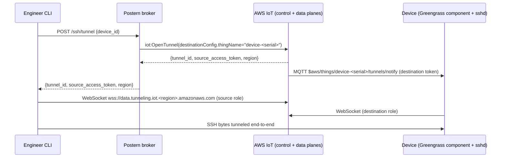

# On-device secure-tunnel destination

Reference for the **device-side** half of Postern's firewalled-device path. Postern itself doesn't ship a device-side tunneling binary — that's an operator concern (per `AGENTS.md` §"What goes here vs elsewhere"). This README describes the v1 reference: AWS IoT Greengrass's `aws.greengrass.SecureTunneling` component.

The cloud-side and CLI-side halves of the path are framework-built — see [`terraform/postern-broker/README.md`](../../../terraform/postern-broker/README.md) §"Tunneling" for the broker's IAM grant and env-var wiring, and the top-level [`README.md`](../../../README.md) §"Tunneling" for the engineer-facing CLI entry points (`postern ssh --tunnel`, `postern scp --tunnel`, `postern tunnel`).

## What this enables

After this is installed, an engineer who is **not** on the device's LAN can run:

```sh
postern ssh --tunnel device-1234           # interactive SSH via tunnel
postern scp --tunnel device-1234:/var/log/foo .   # file copy via tunnel
postern tunnel device-1234                 # hold-open tunnel for rsync/git/VSCode
```

The CLI mints a tunnel via the broker's `/ssh/tunnel` endpoint, starts a pure-Go AWS V3 WebSocket source proxy bound to a loopback port, and spawns ssh / scp against that port. On the device side, the destination component receives the tunnel notification via MQTT and bridges the WebSocket data plane to the device's local `sshd` on port 22 — same cert-auth model, same OpenSSH semantics, same audit trail as the LAN path.

## Architecture overview



The broker holds no state about the tunnel after it returns; the WebSocket data plane is engineer ↔ AWS ↔ device. Tunnels age out at the operator-configured `default_max_lifetime_minutes` (default 8h, max 12h per AWS).

## Prereqs the operator's provisioning must arrange

| Artifact | Where | What populates it |
|---|---|---|
| AWS IoT thing for the device | `device-<serial>` thing-name | Operator's device-onboarding flow registers the thing with IoT Core. The broker uses `destinationConfig.thingName = device-<serial>` on `iot:OpenTunnel` so AWS knows which thing to notify. |
| Device X.509 certificate + private key for IoT Core auth | `/etc/aws/iot/cert.pem` + `/etc/aws/iot/private.key` (or operator's chosen paths) | Provisioned alongside the IoT thing; the Greengrass component uses these to authenticate its MQTT subscription. Out of scope for Postern — see AWS IoT's [device provisioning docs](https://docs.aws.amazon.com/iot/latest/developerguide/iot-provision.html). |
| AWS IoT Greengrass Core software | `/greengrass/v2/` (default install location) | Operator's image build / first-boot setup. See AWS's [Greengrass installation guide](https://docs.aws.amazon.com/greengrass/v2/developerguide/install-greengrass-core-v2.html). |
| `aws.greengrass.SecureTunneling` component deployed to the device | Greengrass deployment from the AWS Console or `gdk` CLI | Operator's deployment workflow. AWS publishes the component; the operator deploys it to the thing's deployment group. |
| sshd configured for Postern cert auth | `/etc/ssh/sshd_config.d/10-postern.conf` | See [`../sshd/README.md`](../sshd/README.md) for the drop-in. The Greengrass tunneling component bridges to whatever port sshd is listening on (22 by default). |

The Greengrass tunneling component is operator-installable from AWS's public component catalog; the framework does not bundle a copy because the component is AWS-published and AWS-versioned.

## How the tunnel reaches the device

When the broker calls `iot:OpenTunnel` with `destinationConfig.thingName = "device-<serial>"`, AWS IoT publishes a notification to the MQTT topic:

```
$aws/things/device-<serial>/tunnels/notify
```

The notification payload includes the destination-side access token and the tunnel ID. The Greengrass `aws.greengrass.SecureTunneling` component subscribes to this topic and, on receipt, opens its own WebSocket to the AWS tunneling data plane in the destination role. The component bridges the WebSocket to a local TCP socket on the device (port 22 for SSH, configurable via the component's `services` property).

The destination access token is never seen by Postern — it goes AWS → device directly. The source access token returned to the engineer's CLI is the only token Postern surfaces, and it's never logged, never cached, never persisted to disk (per invariant T).

## Greengrass component configuration

The AWS-published `aws.greengrass.SecureTunneling` component takes a `services` configuration map that names which device-local TCP ports the tunnel may bridge to. For Postern's v1 use case (one service, "SSH", one port, 22), the deployment-time configuration looks like:

```yaml
# Deployment configuration for aws.greengrass.SecureTunneling
services:
  SSH: 22
```

The service name `SSH` matches Postern's `DefaultServiceID` (see [`internal/securetunnel/proxy.go`](../../../internal/securetunnel/proxy.go)); the source proxy refuses to connect to a tunnel that advertises a different service id, which is what closes the source-side bound on which device ports an engineer can reach via tunnel.

Tightening: operators wanting to restrict the device-side surface further (only allow tunnels at certain times of day, only from certain engineers, etc.) implement those controls at the broker's AVP Cedar policy layer — the `Postern::Action::"OpenTunnel"` action takes the same principal + resource shape as `MintOperatorCert`, so the same group / fleet / source-IP `when` clauses apply.

## Verifying end-to-end

After deploying the component:

```sh
# On the device:
sudo journalctl -u greengrass --since "5 minutes ago"   # watch for tunneling activity
```

From the engineer's machine, with a Postern broker deployed and `tunneling_enabled = true`:

```sh
postern ssh --tunnel device-1234 -v
```

The verbose output should show:

```
opening tunnel for "device-1234" via https://<broker-url>
broker authorized tunnel <tunnel-id> in region <region> (max lifetime 480 minutes)
source proxy listening on 127.0.0.1:<port>
```

If the source proxy starts but the SSH session hangs, the device-side component isn't bridging the tunnel — check the Greengrass logs for MQTT subscription failures or the component's `services` configuration.

## What this does **not** cover

- **Custom destination-side proxies.** Operators with bespoke device-side tunneling (in-house Linux service, Yocto recipe, custom AMI) bring their own destination implementation. AWS IoT publishes the V3 WebSocket protocol guide at [https://github.com/aws-samples/aws-iot-securetunneling-localproxy/blob/main/V3WebSocketProtocolGuide.md](https://github.com/aws-samples/aws-iot-securetunneling-localproxy/blob/main/V3WebSocketProtocolGuide.md); a destination-side implementation speaks the same wire format Postern's source proxy uses.
- **Non-AWS tunneling backends.** Postern's v1 `Tunneling` abstraction has exactly one concrete impl (AWS IoT Secure Tunneling). Operators that need ngrok, Cloudflare Tunnel, Tailscale Funnel, or self-hosted alternatives swap the `Tunneling` impl via constructor injection in their wrapper; the upstream framework ships only the AWS path.
- **Tunnel multiplexing.** v1 is one engineer = one tunnel = one SSH session. Multiple concurrent SSH sessions per tunnel via OpenSSH's `ControlMaster` work over the source proxy's localhost listener, but the broker mints one tunnel per `postern ssh --tunnel` invocation.
